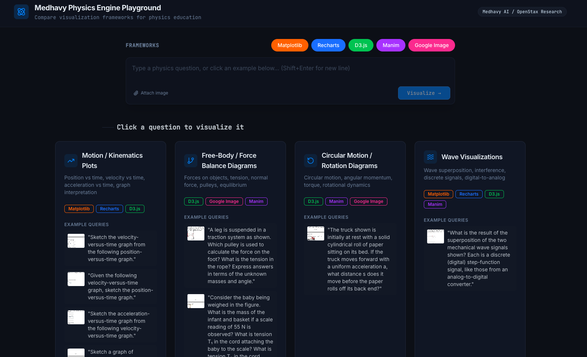

# Medhavy Physics Engine Playground

An interactive playground for evaluating AI-powered physics diagram generation frameworks side-by-side — built to help teams make informed framework and product decisions before committing to a full implementation.

**Live App:** [akshay-personal-projects.com](https://akshay-personal-projects.com/)

**Demo:** [Watch demo](https://drive.google.com/file/d/1Elyfx9rcfeC6IXo3tNFQXNB2wM2CXv3T/view?usp=sharing)

[](https://akshay-personal-projects.com/)

---

## What It Does

The playground takes a physics question as input and routes it through multiple diagram-generation frameworks simultaneously (Matplotlib, Recharts, Gemini AI, etc.), displaying each framework's output, latency, and cost in a unified view. This lets you compare rendering quality and performance characteristics across frameworks using real user query types — before writing a single line of production code.

---

## Why This Exists

When building a physics education product that includes auto-generated diagrams, the most consequential early decision is **which framework to use**. Different frameworks vary significantly in rendering fidelity, latency, cost, and the types of questions they handle well.

This playground exists to make that decision data-driven. Run your actual query set through all candidate frameworks, observe the outputs side-by-side, and choose with confidence.

### Query Dataset

Queries were sourced from the **OpenStax Physics textbook QA dataset**, specifically questions whose canonical answers are diagrams or visualizations. The curated subset used in the playground is available here:

> **Dataset (curated):** [Google Drive — Curated QA Dataset](https://drive.google.com/drive/folders/1qNrn-biF8KyU6kgurKrKb3mfXOP_DW-s?usp=sharing)

---

## Future Directions

### Expand the Dataset
The current dataset is intentionally scoped: it captures questions where the answer *is* a diagram, sourced from diagram-based questions in the OpenStax QA set. However, this leaves value on the table:

- Some text-based questions have diagrams in their answers (e.g., Q53 of Chapter 3 contains an image in the answer but is phrased as a text question). These are excluded from the current set.
- The mapping between a user question and the *type* of diagram needed is theorized conservatively and can be modeled more richly.
- The full, unfiltered OpenStax QA dataset (requiring further analysis and dataset preparation) is available here:

  > **Dataset (full, unfiltered):** [Google Drive — Full QA Dataset](https://drive.google.com/drive/folders/10v5_nXdzp3QRebfYGGqJTFRzqgOvG1kE?usp=sharing)

### Cost & Latency Benchmarking
The playground is designed to be extended. Clone the repo, wire up your own framework integrations, and use the built-in output cards to capture cost and latency metrics per query. This turns the playground into a lightweight benchmarking harness.

### Better Query–Diagram Mapping
A richer model of which user questions necessitate which diagram types would unlock more precise framework evaluation. If you're building on this, that mapping layer (`lib/integrations/`) is the right place to start.

---

## Tech Stack

| Layer | Technology |
|---|---|
| Frontend | React 18, TypeScript, Vite, Tailwind CSS |
| Component library | Radix UI + shadcn/ui |
| Charting | Recharts |
| AI integration | Gemini AI |
| Diagram rendering | Matplotlib (Python 3.11), custom SVG |
| Runtime | Node.js 24, pnpm workspaces |
| Deployment | Autoscale (Replit) |

---

## Project Structure

```
artifacts/
  medhavy-playground/     # React frontend (main app)
  api-server/             # Express API server
  mockup-sandbox/         # Prototyping sandbox
lib/
  integrations/           # Framework-specific diagram generators
  integrations-gemini-ai/ # Gemini AI integration
  api-spec/               # OpenAPI spec + generated client hooks
  db/                     # Database schema (Drizzle ORM)
scripts/                  # Build and post-merge scripts
```

---

## Running Locally

```bash
# Install dependencies
pnpm install

# Start the API server (port 8080)
pnpm --filter @workspace/api-server run dev

# Start the frontend (port 8081)
pnpm --filter @workspace/medhavy-playground run dev

# Full typecheck
pnpm run typecheck

# Build all packages
pnpm run build
```

**Required system packages:** `cairo`, `ffmpeg`, `freetype`, `ghostscript`, `gtk3`, `pkg-config`
(provided automatically via Nix on Replit; install via your system package manager locally)

---

## Deployment

The app is configured for autoscale deployment on Replit with ports:
- `8080` — API server
- `8081` / `80` — Frontend

---

## Contributing

Feel free to fork and build on this playground. The most impactful contributions are:
1. Additional framework integrations under `lib/integrations/`
2. Expanded query dataset with richer question–diagram type mappings
3. Cost and latency instrumentation in the API layer
